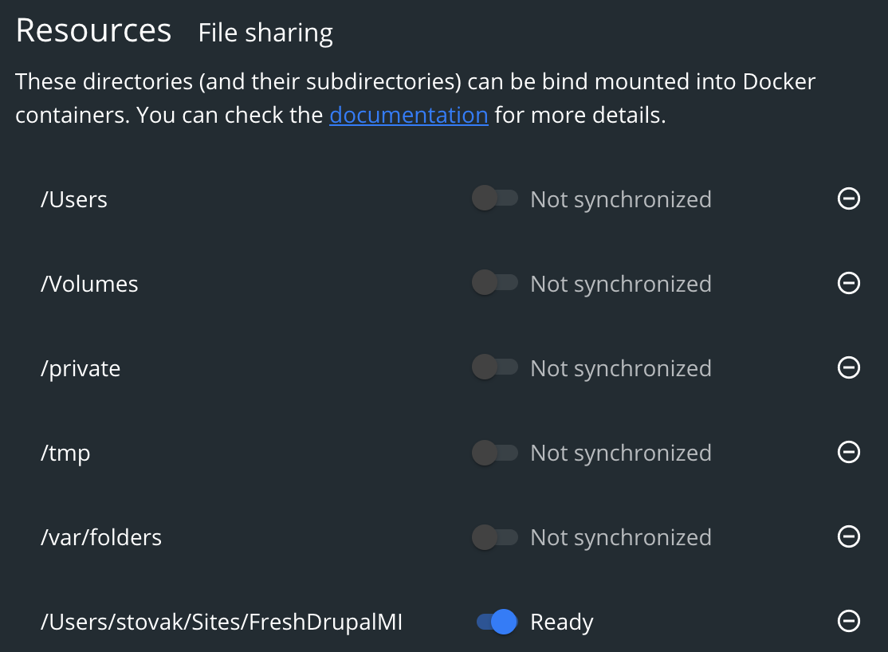

# Docker Stuff #

A docker-based development environment has been created and is provided with this repo. The development environment is
set up to closely mimic the Pantheon environment to which the proejct will be deployed. The development environment
includes an Nginx container for routing, php/node container for code execion, mysql container for database and redis
container for in-memory caching. The definition of this environment is in the DOCKER-COMPOSE.YML file in the root of the
repo.

The container images are hosted on docker hub and maintained for security updates and functionality. The source of
those images is this github repo: https://github.com/milken/development-docker


1. To run the docker containers here, from the root directory just do 'docker-compose pull && docker-compose up -d';

1. To build or change the images, clone the development-docker repo and run bin/build

1. Mac Slowness: On the mac, docker is VERY SLOW if you share a folder with a container. This has to do with the way
   docker mac originallly was syncing the contents of the container. In more recent builds, Docker has provided a
   solution for the slowness in syncing. If you don't have the correct configuration and correct version, please update.
   The speedup can mean as much as a 300% increase in speak at which php code is executed.

    **You need Docker v2.3.4 or newer. Currently that is the "edge" build.**

    1. Make sure you're using the "EDGE" version of docker.

    1. You want to share the entire site in

    ```DOCKER => Preferences => Resources => File Sharing```

    

    Once you select the repo folder for syncing, docker will sync that folder behind the scenes. Once it's ready, it will
    show "ready" with a grean light and starting your docker-compose containers will have about a large speed increase in
    because of the way docker mac does it's file syncing.
