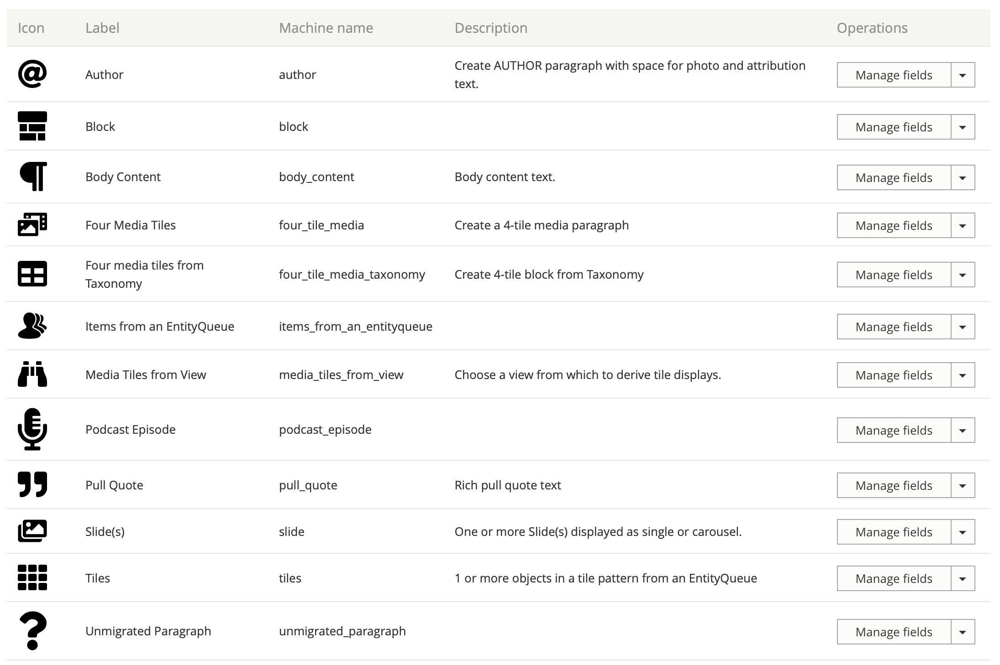

===

# Editing Content #

Most content that users see is added to content nodes in the form of [PARAGRAPHS](https://www.drupal.org/project/paragraphs).
And most of those paragraphs are attached to the node with the field "FIELD_CONTENT".

Adding paragraphs to the FIELD CONTENT is easy enough. Paragraphs take the form of a few different
common content paradigms:

Many of these tiles are simply references to an [EntityQueues](https://www.drupal.org/project/entityqueue). EntityQueues
reference zero or more pieces of content that are specifically intended to be shown in order-- Like slides in a carousel.

Body Text can have multiple body text values or each body text can be a single entry, maybe so as to put a "pull quote"
paragraph between them.

PODCAST EPISODE paragraphs reference a media--podcast_episode media object. This bundle combines an audio file, thumbnail
short description text and links to the iTunes and Sportify podcast locations as well as guest information, playtime
and other relevant data that's specific to the episode.

